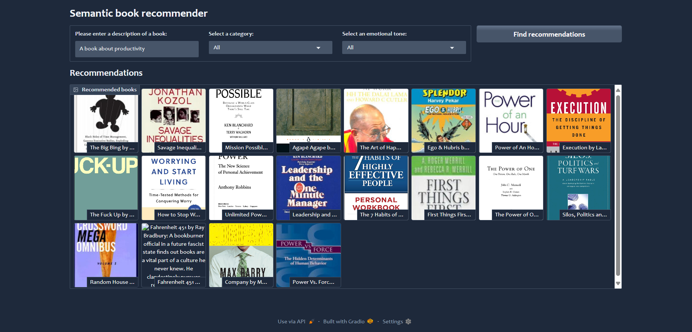

# Book Recommender System 📚

This project is a Semantic Book Recommender System built using Gradio, LangChain, and ChromaDB. It recommends books based on user queries, categories, and emotional tones.




---
Setup Instructions

1.Create a Virtual Environment

It's recommended to use a virtual environment to manage dependencies and avoid conflicts.


Windows Command Prompt (CMD):
```
python -m venv venv
.\venv\Scripts\Activate
```

Mac/Linux Terminal:
```
python3 -m venv venv
source venv/bin/activate
```
---
### Install Dependencies

After activating the virtual environment, run the following command to install all required dependencies:
```
pip install -r requirements.txt
```
---
### Run the Project

To start the Gradio dashboard, run the following command from root folder:

```
cd src
python gradio-dashboard.py
```

---
### Access the Dashboard

Once the command runs successfully, Gradio will provide a local URL (e.g., http://localhost:7860). Open this link in your browser to access the book recommender dashboard.

---
### Troubleshooting

If you face any issues:

- Ensure the virtual environment is activated.
- Verify that all dependencies are correctly installed.
- Check the file paths in your project structure.

For further assistance, feel free to ask! 😊

